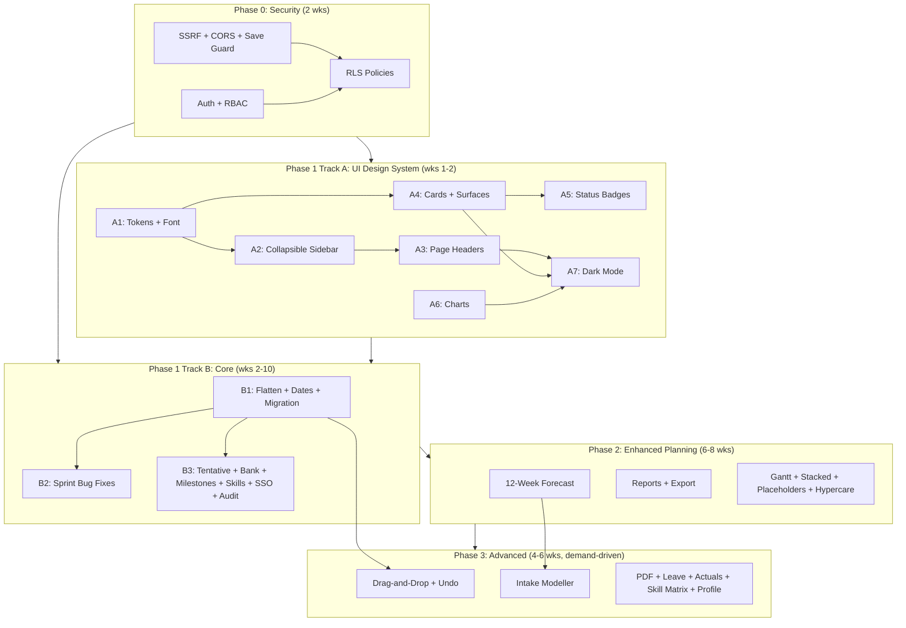

# Master Implementation Roadmap

## VS Finance Capacity Planner — Combined Functional & UI Plan

This plan merges the [Phased Implementation Roadmap](c:\Users\DennisSimon.cursor\plans\phased_implementation_roadmap_3e847177.plan.md) and the [UI Redesign Plan](c:\Users\DennisSimon.cursor\plans\ui_redesign_implementation_7a8956c1.plan.md) into a single sequenced delivery plan.

**Key principle:** The UI design system is established before feature work begins so that every new feature is built with Mileway tokens, not retrofitted.

---

## Phase 0 — Security & Stability (Est. 2 weeks)

**Goal:** Close all critical vulnerabilities. No feature or UI work ships until this is done.

- **0.1 SSRF fix** — `isAllowedJiraUrl()` in `api/jira.js`: reject anything not `*.atlassian.net` over HTTPS. ~2h
- **0.2 CORS lock** — Replace `Access-Control-Allow-Origin:` * with `FRONTEND_URL` env var (`capacity-planner-mw.vercel.app`). ~1h
- **0.9 Concurrent save guard** — `isSaving` mutex in `supabaseSync.ts`. ~1h
- **AD-8.1 Basic auth + RBAC** — Supabase email/password auth. `user_roles` table (4 roles). `useCurrentUser()` hook + `PermissionGate` component. Login page. ~4 days
- **0.4 RLS policies** — Drop `USING (true)` on all tables, replace with `auth.role() = 'authenticated'`. Depends on AD-8.1. ~1 day
- **SP-3.2 Scenario gap fixes** — Atomic creation, rename-on-blur fix. ~2h

**Exit criteria:** CORS locked, SSRF blocked, all tables require auth session, login page works.

---

## Phase 1 — UI Foundation + Core Improvements (Est. 8–10 weeks)

Two parallel tracks. Track A (UI Design System) runs first — its output is the visual infrastructure that Track B features build on.

### Track A — UI Design System (Weeks 1–2, ~19 hours total)

**Goal:** Apply the Mileway design system across the entire app. Every feature built from Phase 1c onwards uses these tokens, components, and layout.

#### A1. Tokens & Font (~2h)

Files: `[frontend/index.html](frontend/index.html)`, `[frontend/tailwind.config.js](frontend/tailwind.config.js)`, `[frontend/src/index.css](frontend/src/index.css)`, `[frontend/src/App.tsx](frontend/src/App.tsx)`

- Swap Inter → **Plus Jakarta Sans** (weights 300–700) in `index.html`
- Extend `tailwind.config.js` with full Mileway palette and custom font scale:
  - `mw.primary` (#0089DD), `mw.dark` (#003E65), `mw.grey` (#6C7A89), light/hover variants
  - Utilisation scale: `util.bench`, `util.healthy`, `util.near`, `util.over`
  - Font sizes: xs=11px through 4xl=36px with paired line heights
  - `borderRadius.card: '10px'`
- Remove old CSS vars from `index.css`. Update body font. Update scrollbar colours.
- In `App.tsx`: set `data-theme="dark"` alongside `classList.add('dark')` for future CSS variable scoping.

#### A2. Collapsible Sidebar (~5h)

Files: `frontend/src/components/layout/Sidebar.tsx` (new), `[Layout.tsx](frontend/src/components/layout/Layout.tsx)` (rewrite), `NotificationBanners.tsx` (new), `Header.tsx` (retire)

Redistribute all Header content:

| Content                 | New location                                                        |
| ----------------------- | ------------------------------------------------------------------- |
| Logo + app name         | Sidebar top: "VS Finance" + "Capacity Planner" + 2px blue underline |
| Navigation (6 items)    | Sidebar nav: icon + label, Mileway blue left-border active state    |
| Sync indicator          | Sidebar footer                                                      |
| Dark mode toggle        | Sidebar footer                                                      |
| Scenario selector       | Sidebar footer (compact)                                            |
| Scenario / Jira banners | `NotificationBanners.tsx` strip between sidebar and main content    |

Sidebar behaviours:

- `w-[240px]` expanded / `w-[60px]` collapsed (icon-only), persisted in localStorage
- `transition-[width] duration-200 ease-in-out`
- Layout becomes `flex h-screen overflow-hidden` with sidebar + scrollable content area

#### A3. Page Headers (~2h)

New file: `frontend/src/components/layout/PageHeader.tsx`
Apply paired title + subtitle to all 6 pages:

| Page      | Title             | Subtitle                             |
| --------- | ----------------- | ------------------------------------ |
| Dashboard | Capacity Overview | VS Finance · Q{n} 2026 · Mileway BV  |
| Timeline  | Timeline          | Q1–Q4 2026 · VS Finance · Mileway BV |
| Epics     | Epics             | Change projects and initiatives      |
| Team      | Team              | {n} members · {n} countries          |
| Scenarios | Scenarios         | What-if planning workspace           |
| Settings  | Settings          | Configuration and preferences        |

Fix all `text-[10px]` instances (spec minimum is 11px).

#### A4. Cards & Surfaces (~3h)

- All cards: `rounded-lg` (8px) → `rounded-card` (10px). Border: `border-mw-grey-light`.
- Primary cards: `border-l-[3px] border-mw-primary`
- Page background: `bg-mw-grey-lighter` (light) / `dark:bg-[#0D1B2A]` (dark)
- Card backgrounds: `bg-white` / `dark:bg-[#132133]`
- Box-shadow only on modals and floating dropdowns

#### A5. Status Badges (~2h)

Update/create `frontend/src/components/ui/Badge.tsx`:
Style: `px-2 py-[3px] rounded-full text-xs font-bold tracking-wide uppercase`
Variants: `green | amber | red | blue | grey | tentative | beginner | intermediate | advanced | expert`

Apply to: project status, RAG indicators, sync indicator, confidence badges in `JiraHierarchyTree.tsx`.

#### A6. Charts (~3h)

Create `frontend/src/components/ui/ChartTooltip.tsx` (reusable). Apply to all recharts:

- Remove `<CartesianGrid />` from all charts
- `axisLine={false}` `tickLine={false}` `tickCount={3}` on all axes
- `fill: '#6C7A89'` + `fontFamily: 'Plus Jakarta Sans'` on tick labels
- `borderRadius: [4,4,0,0]` on all bars
- Series colours: available=`#E8F4FB`/`#0089DD`, committed=`#003E65`, tentative=`#6C7A89` dashed

#### A7. Dark Mode Alignment (~2h)

Replace all `dark:bg-slate-`* and `dark:border-slate-`* with navy-based equivalents:

| Before                  | After                   |
| ----------------------- | ----------------------- |
| `dark:bg-slate-900`     | `dark:bg-[#0D1B2A]`     |
| `dark:bg-slate-800`     | `dark:bg-[#132133]`     |
| `dark:bg-slate-700`     | `dark:bg-[#1A2D45]`     |
| `dark:border-slate-700` | `dark:border-[#1E3550]` |
| `dark:text-slate-300`   | `dark:text-[#E8F4FB]`   |
| `dark:text-slate-400`   | `dark:text-[#8BA8BF]`   |

Sidebar always uses navy regardless of theme mode.

---

### Track B — Architecture & Core Features (Weeks 2–10)

All new features built in this track use the design system established in Track A.

#### B1. Architecture Refactors (Weeks 2–4)

- **0.5 Flatten assignments** — `Assignment[]` moves from `Phase` to top-level `AppState.assignments` with `projectId` + `phaseId`. New `assignments` Supabase table. Update `capacity.ts`, `supabaseSync.ts`, `appStore.ts`, all UI. Data migration script. ~5 days. **Highest-risk item.**
- **0.8 Phase date system** — `startDate`/`endDate` (ISO) become primary on `Phase`. Derive quarters from dates. Deprecate `startQuarter`/`endQuarter`. ~2 days
- **0.10 Schema migration logic** — `migrate(data, fromVersion)` in `appStore.ts`. ~1 day
- **0.6 Quarter sort fix** — `compareQuarters()` utility (no stored format change). ~2h
- **0.11 Remove whatIfData** — Search and remove `enterWhatIfMode` / `exitWhatIfMode`. ~1h

#### B2. Bug Fixes (Week 4)

- **CP-2.3 Sprint calculator (4 bugs)** in `Timeline.tsx`:
  - BAU excludes bye weeks from divisor
  - Sprint workdays use actual calendar (not averaged)
  - Progress bar max = `sprintWorkdays` (not hardcoded 15)
  - Quarter header respects public holidays
  - ~1 day total

#### B3. New Features (Weeks 5–10)

Each feature is built with the Track A design system already in place.

- **CP-2.6 Tentative bookings** — `tentative: boolean` on `Assignment`. Dashed border + 65% opacity using `assignment-bar--tentative` CSS from spec. Context menu "Confirm" action. ~2 days
- **NEW-C Capacity Bank card** — Dashboard component: Available / Committed / BAU / Buffer per quarter. 36px bold number + RAG dot + stacked bar. Styled per spec Section 7.2. ~2 days
- **NEW-A Milestone markers** — `Milestone` entity. Vertical line on Timeline with flag label. Styled per spec Section 6.5. Supabase table. ~2 days
- **SK-4.1 Skill proficiency levels** — 4-tier `ProficiencyLevel` on `TeamMemberSkill`. Proficiency badges use `badge-beginner/intermediate/advanced/expert` from Badge.tsx. CSV import. ~3 days
- **AD-8.2 Azure AD SSO** — Supabase Azure provider. Azure App Registration. Group-to-role mapping. Login page with "Sign in with Microsoft" + email fallback. ~4 days
- **AD-8.5 Audit trail** — `audit_log` table. Fire-and-forget writes in `supabaseSync.ts`. Admin-only page. CSV export. ~2 days
- **0.3 Jira token vault** — Move API tokens to Supabase Vault via Edge Function. Client stores `apiTokenVaultId` only. ~3 days

---

## Phase 2 — Enhanced Planning & Reporting (Est. 6–8 weeks)

All UI work in this phase follows the established design system. New charts use `ChartTooltip.tsx` and recharts config from Track A6.

- **CP-2.4 / RS-5.2 Rolling 12-week forecast** — recharts `AreaChart` per spec Section 8.4: blue fill area (available), navy line (committed), grey dashed (tentative), red/green reference areas. Role filter. Dashboard placement below heatmap. ~5 days
- **RS-5.1 Utilisation report + export** — Configurable period. Target utilisation % per role in Settings. Excel (SheetJS) + branded PDF (jsPDF). ~3 days
- **SP-3.3 Scenario comparison** — Extend `ScenarioDiffModal`: metric cards + delta arrows (green = better, red = worse). ~2 days
- **SP-3.4 Publish scenario confirmation** — Dialog showing added/removed/modified count + affected members. Auto-archive previous plan. ~2 days
- **AD-8.3 Part-time overrides + company closures** — `workingHoursPerDay`, `workingDays` on `TeamMember`. `CompanyClosureDay` table. Capacity calc deducts these. ~2 days
- **RV-1.3 Gantt view on Epics page** — List/Gantt toggle on `Projects.tsx`. Horizontal project bars spanning phase dates on a quarter axis. Styled with project colours. ~3 days
- **SK-4.3 Skill proficiency on phases** — `RequiredSkill` with `minProficiency`. Mismatch check function. Amber `⚠` badge on assignment blocks. ~2 days
- **CP-2.2 Stacked allocation blocks** — Multiple project blocks stacked vertically in a member's cell. Proportional heights. Overallocation indicator. ~2 days
- **JI-6.2 Velocity calculation** — Fetch last 6 closed sprints. Average velocity displayed as benchmark in sprint view. ~1 day
- **CP-2.5 Improved overallocation alerts** — Check all future quarters (not just current). Configurable threshold per person and team. Immediate badge + banner. ~1 day
- **CP-2.7 Placeholder resources** — `isPlaceholder` flag on `TeamMember`. Dotted outline, grey avatar, "TBD" suffix. "Convert to person" action. ~1 day
- **NEW-B Hypercare phase type** — `phaseType` on `Phase`. Diagonal stripe CSS on timeline bars per spec Section 6.3 (amber for hypercare, grey for stabilisation). ~0.5 days

---

## Phase 3 — Advanced Features (Est. 4–6 weeks, demand-driven)

Build only when there is confirmed user demand. Each item is independently scoped and brings its UI treatment from the spec.

- **CP-2.1 Drag-and-drop planner** — Pointer-event drag on Timeline. Create/slide/resize/reassign. Ghost bar, snap-to-boundary, live capacity update. Full UI from spec Section 6.3 (drag handles, ghost/preview bar styles). Depends on B1 (flat assignments, ISO dates). ~10 days
- **UX-7.2 Undo/Redo** — Session-only history store (20 levels). Ctrl+Z/Y. Build only alongside CP-2.1. ~3 days
- **SP-3.1 Intake modeller** — Sandbox form (roles, duration, skills). Overlay on 12-week forecast. Feasibility summary. "Create as Tentative" action. ~5 days
- **RS-5.5 Branded PDF export** — One-click: heatmap + forecast + sprint table. Mileway header, A4, jsPDF + html2canvas. ~3 days
- **AD-8.4 Leave request workflow** — Self-service form + Team Lead approval queue. Calendar impact preview. `time_off_requests` table. ~4 days
- **JI-6.4 Jira time-logged actuals** — Sync worklogs. `actual_hours` table. Only if team actually logs time in Jira. ~3 days
- **RS-5.3 Planned vs. actual** — Burn-down chart per project. Variance %. Depends on JI-6.4. ~3 days
- **UX-7.1 Inline edit improvements** — Tab navigation between fields, Escape to cancel. ~1 day
- **SK-4.2 Skill matrix view** — Members × skills grid with proficiency cells. Bench strength indicators. Full UI per spec Section 10. Excel export. ~2 days
- **RV-1.4 Individual member profile page** — Schedule timeline + leave overlay. Self-view. Full side panel UI per spec Section 11.2. Depends on auth (Phase 0) being live. ~3 days

---

## UI spec items deferred until functional feature is built

| UI spec section                         | Deferred until                                   |
| --------------------------------------- | ------------------------------------------------ |
| 6.3 Drag handles / ghost / preview bars | CP-2.1 (Phase 3)                                 |
| 9 Weekly heatmap cells                  | RV-1.2 weekly granularity — not in current scope |
| 10 Skill matrix grid                    | SK-4.2 (Phase 3)                                 |
| 11.2 Side panel component               | RV-1.4 (Phase 3)                                 |

## Items explicitly excluded

| Item                         | Reason                                                            |
| ---------------------------- | ----------------------------------------------------------------- |
| JI-6.3 Capacity push to Jira | Capacity planner is system of record; push is redundant           |
| RV-1.2 Workload Heatmap      | Already exists — was built in Phase 2 redesign                    |
| UX-7.5 Ctrl+K Search         | Already exists — CommandPalette is bound to Ctrl+K                |
| SK-4.5 Auto-assign rebuild   | Already exists in `assignmentSuggester.ts`; surface in UI instead |
| UX-7.3 Saved filter views    | Low value for 10-person team                                      |
| UX-7.4 Email notifications   | Over-engineered for co-located team                               |
| RS-5.4 Bench report          | Heatmap already surfaces under-utilised members                   |
| RS-5.5 AI highlights         | Defer until basic PDF export is in use                            |

---

## Full dependency diagram

---

## Timeline & Effort Summary

| Phase                                     | Duration        | Effort                  |
| ----------------------------------------- | --------------- | ----------------------- |
| Phase 0 — Security                        | 2 weeks         | ~8 days                 |
| Phase 1 Track A — UI Design System        | 2 weeks         | ~~19 hours (~~2.5 days) |
| Phase 1 Track B — Architecture + Features | 6–8 weeks       | ~25 days                |
| Phase 2 — Enhanced Planning               | 6–8 weeks       | ~24 days                |
| Phase 3 — Advanced (demand-driven)        | 4–6 weeks       | ~30 days                |
| **Total**                                 | **20–26 weeks** | **~90 days**            |

