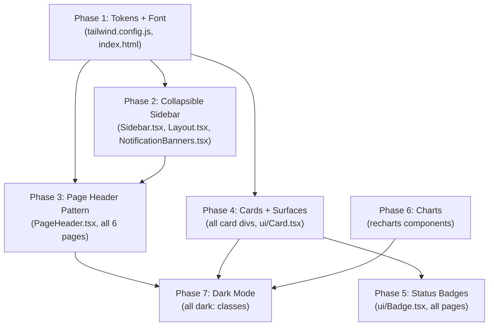

# UI Redesign Implementation Plan

Based on the [UI design spec](c:\Users\DennisSimon\Downloads\ui_design_spec.md) and review recommendations. Uses a collapsible sidebar approach and maps all design tokens into `tailwind.config.js`.

---

## Current state summary

- **Layout:** `Layout.tsx` renders `<Header />` + `<main className="max-w-[1440px]">`. No sidebar exists.
- **Header:** `Header.tsx` contains horizontal nav tabs, scenario banners, Jira baseline warning, sync indicator, scenario selector, and dark mode toggle — all in one file.
- **Tailwind:** `tailwind.config.js` has only `fontFamily.sans: ['Inter', ...]`. No brand colour extensions.
- **Font:** Inter, loaded in `index.html`.
- **Dark mode:** `classList.add('dark')` in `App.tsx`. All dark styles use `dark:` Tailwind prefix.

---

## Phase 1 — Foundation: Tokens & Font (~2 hours)

**Goal:** Establish Mileway brand tokens as the single source of truth in Tailwind before touching any component.

### 1.1 Font swap

File: `[frontend/index.html](frontend/index.html)`

- Replace Inter Google Fonts link with Plus Jakarta Sans (weights 300–700)

```html
<!-- Replace this: -->
<link href="https://fonts.googleapis.com/css2?family=Inter:wght@400;500;600;700&display=swap" rel="stylesheet">

<!-- With this: -->
<link href="https://fonts.googleapis.com/css2?family=Plus+Jakarta+Sans:wght@300;400;500;600;700&display=swap" rel="stylesheet">
```

### 1.2 Tailwind theme extension

File: `[frontend/tailwind.config.js](frontend/tailwind.config.js)`

Extend the theme with Mileway brand colours, custom font sizes, and retain `darkMode: 'class'`:

```js
theme: {
  extend: {
    fontFamily: {
      sans: ['Plus Jakarta Sans', 'ui-sans-serif', 'system-ui', '-apple-system', 'sans-serif'],
    },
    colors: {
      mw: {
        primary:      '#0089DD',
        'primary-light': '#E8F4FB',
        'primary-mid':   '#4AADEA',
        dark:         '#003E65',
        'dark-hover': '#002D4A',
        grey:         '#6C7A89',
        'grey-light': '#E2ECF5',
        'grey-lighter': '#F5F8FC',
      },
      util: {
        bench:   '#F5F8FC',
        healthy: '#0089DD',
        near:    '#D97706',
        over:    '#DC2626',
      },
    },
    fontSize: {
      'xs':   ['11px', { lineHeight: '1.2' }],
      'sm':   ['12px', { lineHeight: '1.35' }],
      'base': ['14px', { lineHeight: '1.5' }],
      'md':   ['15px', { lineHeight: '1.5' }],
      'lg':   ['16px', { lineHeight: '1.35' }],
      'xl':   ['18px', { lineHeight: '1.35' }],
      '2xl':  ['22px', { lineHeight: '1.2' }],
      '3xl':  ['28px', { lineHeight: '1.2' }],
      '4xl':  ['36px', { lineHeight: '1.0' }],
    },
    borderRadius: {
      card: '10px',
    },
  },
}
```

### 1.3 Global styles update

File: `[frontend/src/index.css](frontend/src/index.css)`

- Remove old `--color-primary`, `--color-success`, `--color-warning`, `--color-danger` CSS vars (now in Tailwind)
- Update `body` font-family to use the new stack
- Keep scrollbar styles but update colours to use Mileway tokens (`mw-grey-lighter`, `mw-grey-light`)
- Add `data-theme` attribute support alongside the existing `dark` class in `App.tsx`:
  - In `App.tsx`, alongside `classList.add('dark')`, also set `document.documentElement.setAttribute('data-theme', 'dark')` — this ensures both Tailwind's `dark:` prefix and any CSS variable scoping via `[data-theme]` work simultaneously

---

## Phase 2 — Collapsible Sidebar (~5 hours)

**Goal:** Replace the horizontal header with a collapsible navy sidebar. Migrate all header content (nav, banners, sync) to appropriate new locations.

### Current Header responsibilities to redistribute


| Content               | Current location | New location                           |
| --------------------- | ---------------- | -------------------------------------- |
| Logo + app name       | Header           | Sidebar top                            |
| Navigation tabs       | Header           | Sidebar nav                            |
| Sync indicator        | Header right     | Sidebar footer                         |
| Dark mode toggle      | Header right     | Sidebar footer                         |
| Scenario selector     | Header right     | Sidebar footer (above user area)       |
| Scenario banner       | Below header     | Strip between sidebar and main content |
| Jira baseline warning | Below header     | Same strip as scenario banner          |


### 2.1 Create `Sidebar.tsx`

New file: `frontend/src/components/layout/Sidebar.tsx`

```
Sidebar structure:
┌─────────────────────┐
│ Logo area           │  ← "VS Finance" + "Capacity Planner" + 2px blue underline
│─────────────────────│
│ Nav items (6)       │  ← Icon + label, active = blue left border + tinted bg
│                     │
│ [collapse toggle]   │  ← ChevronLeft/Right at bottom of nav
│─────────────────────│
│ Scenario selector   │  ← Compact version
│ Sync indicator      │
│─────────────────────│
│ User avatar + name  │  ← Shows when auth is live; for now: dark mode toggle
└─────────────────────┘
```

Key behaviours:

- `collapsed` state (localStorage persisted): `w-[240px]` expanded, `w-[60px]` collapsed
- Collapsed: show icon only, hide all text labels. Logo area shows "MW" monogram only.
- Transition: `transition-[width] duration-200 ease-in-out`
- Nav active state: `border-l-[3px] border-mw-primary bg-mw-primary/10 text-white font-semibold`
- Nav inactive: `border-l-[3px] border-transparent text-white/60 hover:text-white/90 hover:bg-white/6`

### 2.2 Update `Layout.tsx`

File: `[frontend/src/components/layout/Layout.tsx](frontend/src/components/layout/Layout.tsx)`

Replace the current header-above-content structure with a flex-row sidebar-beside-content layout:

```tsx
// Before:
<div className="min-h-screen bg-slate-50 dark:bg-slate-900">
  <Header />
  <main className="max-w-[1440px] mx-auto px-8 py-6">{children}</main>
</div>

// After (conceptual):
<div className="flex h-screen overflow-hidden bg-mw-grey-lighter dark:bg-[#0D1B2A]">
  <Sidebar collapsed={collapsed} onToggle={setCollapsed} />
  <div className="flex flex-col flex-1 min-w-0 overflow-hidden">
    <NotificationBanners />  {/* scenario + Jira baseline banners */}
    <main className="flex-1 overflow-auto p-8">{children}</main>
  </div>
</div>
```

### 2.3 Extract `NotificationBanners.tsx`

New file: `frontend/src/components/layout/NotificationBanners.tsx`

Move the two banners from `Header.tsx` into this component:

- Jira baseline warning banner (amber)
- Scenario active banner (blue)

These sit as a zero-height-when-empty strip between the sidebar and the page content, full width of the content area.

### 2.4 Archive `Header.tsx`

After the sidebar is confirmed working, rename `Header.tsx` to `Header.tsx.bak` or delete it. All its functionality will have been redistributed.

---

## Phase 3 — Page Header Pattern (~2 hours)

**Goal:** Apply the paired title + subtitle pattern consistently across all 7 pages.

Create a reusable `PageHeader` component:

```tsx
// New component: frontend/src/components/layout/PageHeader.tsx
interface PageHeaderProps {
  title: string;
  subtitle: string;
  actions?: ReactNode;
}
// Renders: 28px/700/navy title + 14px/400/grey subtitle + right-aligned actions
```

Apply to all pages with the following title/subtitle pairs:


| Page             | Title             | Subtitle                                    |
| ---------------- | ----------------- | ------------------------------------------- |
| Dashboard        | Capacity Overview | VS Finance · {current quarter} · Mileway BV |
| Timeline         | Timeline          | Q1–Q4 2026 · VS Finance · Mileway BV        |
| Projects (Epics) | Epics             | Change projects and initiatives             |
| Team             | Team              | {n} members · {n} countries · VS Finance    |
| Scenarios        | Scenarios         | What-if planning workspace                  |
| Settings         | Settings          | Configuration and preferences               |


Files to update: `[Dashboard.tsx](frontend/src/pages/Dashboard.tsx)`, `[Timeline.tsx](frontend/src/pages/Timeline.tsx)`, `[Projects.tsx](frontend/src/pages/Projects.tsx)`, `[Team.tsx](frontend/src/pages/Team.tsx)`, `[Scenarios.tsx](frontend/src/pages/Scenarios.tsx)`, `[Settings.tsx](frontend/src/pages/Settings.tsx)`

Also fix any text below 11px across all pages (the spec minimum). Search for `text-[10px]` instances.

---

## Phase 4 — Cards & Surfaces (~3 hours)

**Goal:** Apply consistent card styling using Mileway tokens.

Changes applied across all card components:

- `rounded-lg` (8px) → `rounded-card` (10px Tailwind custom) — update all card wrapper divs
- Add left accent border to primary cards: `border-l-[3px] border-mw-primary`
- Card borders: `border-mw-grey-light` instead of `border-slate-200`
- Card backgrounds: `bg-white` (light) / `dark:bg-[#132133]` (dark) instead of `dark:bg-slate-800`
- Page background: `bg-mw-grey-lighter` instead of `bg-slate-50`
- Only elevated/floating elements (modals, dropdowns) get box-shadow

Key files to update:

- All card wrapper `div`s in `Dashboard.tsx`, `Projects.tsx`, `Team.tsx`, `Scenarios.tsx`
- `frontend/src/components/ui/` — Card, Modal, and Dropdown components

---

## Phase 5 — Status Badges (~2 hours)

**Goal:** Standardise all status indicators to pill-shaped ALL-CAPS badges.

Create or update `frontend/src/components/ui/Badge.tsx` with variants:

```tsx
type BadgeVariant = 'green' | 'amber' | 'red' | 'blue' | 'grey' | 'tentative' |
                   'beginner' | 'intermediate' | 'advanced' | 'expert';
```

Style: `px-2 py-[3px] rounded-full text-xs font-bold tracking-wide uppercase`

Apply to:

- Project status badges throughout `Projects.tsx`
- RAG utilisation badges on `Dashboard.tsx` and `Timeline.tsx`
- Sync indicator labels in `Sidebar.tsx`
- Confidence level badges in `JiraHierarchyTree.tsx`

---

## Phase 6 — Charts (~3 hours)

**Goal:** Apply Mileway chart styling to all recharts components.

Changes to make:

- Remove `<CartesianGrid />` from all charts
- Set `tickCount={3}` on all Y axes
- Set `axisLine={false}` and `tickLine={false}` on all axes
- Apply `fill: '#6C7A89'` and `fontFamily: 'Plus Jakarta Sans'` to axis tick labels
- Replace default recharts tooltips with the `CustomTooltip` component (from spec Section 8.3)
- Apply `borderRadius: [4, 4, 0, 0]` to all bar chart elements
- Apply series colours from spec Sections 8.4 and 8.5

Create: `frontend/src/components/ui/ChartTooltip.tsx` — reusable CustomTooltip

Files to update: any page or component using recharts (`AreaChart`, `BarChart`, `LineChart`)

---

## Phase 7 — Dark Mode Alignment (~2 hours)

**Goal:** Ensure dark mode is coherent with the new navy-based palette rather than slate-based.

Key colour substitutions for dark mode:


| Current (slate-based)   | New (navy-based)                                   |
| ----------------------- | -------------------------------------------------- |
| `dark:bg-slate-900`     | `dark:bg-[#0D1B2A]`                                |
| `dark:bg-slate-800`     | `dark:bg-[#132133]`                                |
| `dark:bg-slate-700`     | `dark:bg-[#1A2D45]`                                |
| `dark:border-slate-700` | `dark:border-[#1E3550]`                            |
| `dark:text-slate-300`   | `dark:text-[#E8F4FB]`                              |
| `dark:text-slate-400`   | `dark:text-[#8BA8BF]`                              |
| Sidebar background      | Always `bg-mw-dark` (#003E65) — same in both modes |


The sidebar always uses the navy palette regardless of light/dark mode. Only the main content area changes.

---

## Scope exclusions (spec items not in this plan)

These sections of the UI spec are deferred until the corresponding functional features are built:


| Spec section                  | Reason deferred                                      |
| ----------------------------- | ---------------------------------------------------- |
| 6.3 Drag handles / ghost bars | Requires CP-2.1 (drag-and-drop) — Phase 3 functional |
| 9 Weekly heatmap cells        | Current heatmap is quarterly; weekly is deferred     |
| 10 Skill matrix               | Requires SK-4.2 (Phase 3 functional)                 |
| 11.2 Side panel               | Requires RV-1.3/RV-1.4 (Phase 2 functional)          |


---

## Dependency diagram




---

## Estimated effort


| Phase                         | Effort        | Risk                                               |
| ----------------------------- | ------------- | -------------------------------------------------- |
| Phase 1 — Foundation          | ~2 hours      | Low                                                |
| Phase 2 — Collapsible Sidebar | ~5 hours      | Medium (most complex — redistributes Header logic) |
| Phase 3 — Page Headers        | ~2 hours      | Low                                                |
| Phase 4 — Cards & Surfaces    | ~3 hours      | Low                                                |
| Phase 5 — Status Badges       | ~2 hours      | Low                                                |
| Phase 6 — Charts              | ~3 hours      | Low                                                |
| Phase 7 — Dark Mode           | ~2 hours      | Low                                                |
| **Total**                     | **~19 hours** |                                                    |


