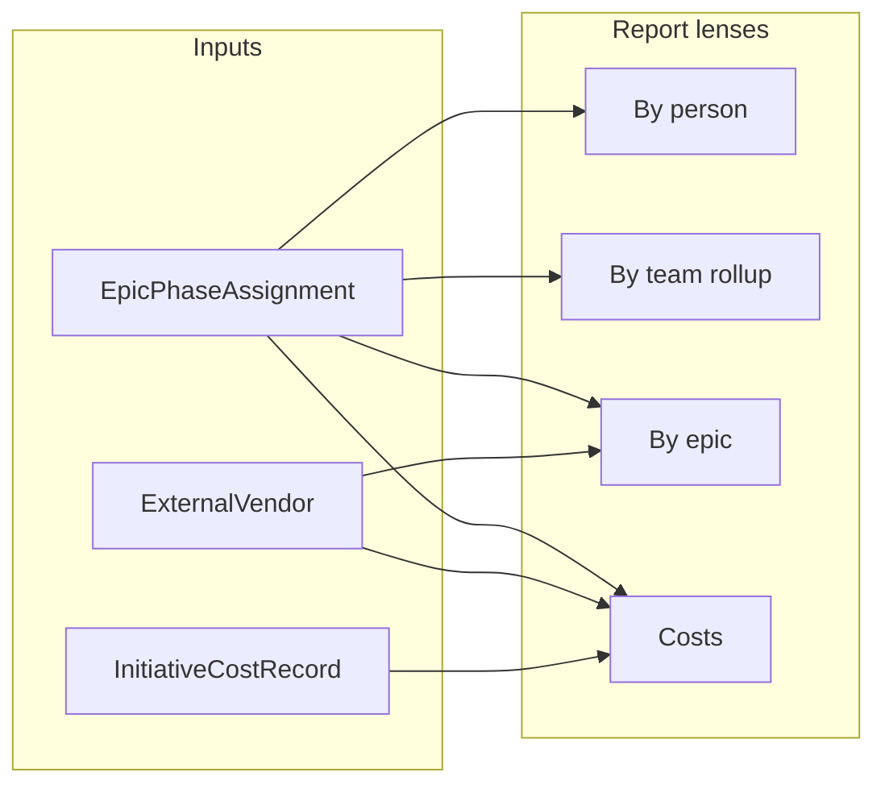

# Portfolio reporting: requirements alignment and recommendations

## Phase 0: Easy mockups (before any implementation)

Goal: **validate reading flow and density** with stakeholders using **low-fidelity** artifacts—no real data wiring yet.

**Deliverables (keep each to 1–2 screens per lens):**

- **Global context bar** — scenario, period, currency (labels only).
- **Lens tabs** — Person | Process team | Squad | Planning group | Epic | Costs (same chrome everywhere).
- **One primary table pattern** — fake rows/columns: epic, total days, phase columns (abbreviated), optional expand affordance.
- **Epic lens** — small block for internal / external / business **days** + sub-table “by vendor”.
- **Costs lens** — row per epic with IT labor, BIZ labor, hardware, licenses, contingency, total (fake numbers).
- **PDF outline** — single page sketch: section order + what appears above the fold (executive strip + first table).

**Where to produce mockups:**

- **Default (per stakeholder preference):** **Separate files in this repository** — e.g. static HTML wireframes, exported PNG/PDF from Figma, or Markdown with embedded images — under something like `docs/features/portfolio-reporting/mockups/` (exact folder name flexible). Open in a browser or viewer; **no integration** into the React app, routing, or `planning-mockups`.
- **External-only** (optional): Figma, Whimsical, Miro — still fine; if used, export snapshots or links documented in a small `README` next to the deliverables so the repo stays the source of truth for “what we agreed.”

**Exit criteria for Phase 0:** Mockups delivered; you review and **request changes on the mockups only** (iterate files under `docs/` as needed) until the layout and lenses are acceptable.

---

## Approval gate: in-app build (mandatory)

**Nothing in the application codebase** (frontend utilities, React UI, PDF wiring, costing changes) is in scope **until you give explicit, written approval** to proceed with implementation—e.g. a clear message in chat, a comment on the PR, or a line added to this plan / a short decision note in `docs/` (whichever you prefer to use as the record).

- **Before approval:** Only mockup assets and plan/docs updates.
- **After approval:** Todos `aggregators`, `reports-ui`, `pdf-structured`, and optional `labor-cost-split` may be executed in the order below.

This is intentional: mockup feedback loops **do not** imply permission to start building in the tool.

---

## What the product already supports (relevant to your list)

| Your ask | Existing source (conceptual) | Notes |
|----------|------------------------------|--------|
| Epics per person, days per epic, phase breakdown | [`frontend/src/utils/portfolioPlanExport.ts`](frontend/src/utils/portfolioPlanExport.ts) — `ExportEpicDetail` / `ExportPhaseDetail` / `ExportAssignmentDetail`; assignments rolled by actor | Excel/CSV export paths already build this graph; PDF today is a **subset** in [`frontend/src/components/report/PortfolioPlanPDF.tsx`](frontend/src/components/report/PortfolioPlanPDF.tsx). |
| **Internal vs external vs business** (days) | [`frontend/src/utils/planningGroups.ts`](frontend/src/utils/planningGroups.ts) — `PlannedDaysTotals` buckets: `it_team_members`, `external_partners`, `business_owners_and_teams`, `other_it_teams` | Use the same bucketing as the board for **effort (days)**, including per-epic and per-phase rollups. |
| **External party** (days / cost) | `TeamMember.workerType` + `externalVendorId`; planning groups with `category: external_partner` + vendor | Roll up by **vendor name** for externals; show placeholder/group name where used. |
| Phases | Dynamic phase instances + ordering via `buildOrderedPhaseEntries` (used in export) | Reports should use **instance-aware** phase labels (not only legacy `design/build/...`). |
| Costs per epic | [`frontend/src/utils/costing.ts`](frontend/src/utils/costing.ts) — `InitiativeCostSummary`: `itLaborCost`, `bizLaborCost`, `directCost`, `contingencyCost`, `totalCost`; `directCostRecord` has **hardware** + **licenses** arrays | **Labor** is split by **track (IT vs BIZ)**, not by internal vs external. **Direct** is hardware + license lines (no separate “one-time” type today—see gap below). |

---

## UX recommendation: fewer context switches, easier reading

**Single “Portfolio reports” surface** (within Portfolio Planning or a dedicated `report` sub-route) with:

1. **One global context bar** (fixed): scenario vs baseline, quarter/date range, reporting currency, board epic set — so every lens uses the same slice of reality.
2. **Lens selector** (your dimensions): *Person* | *Process team* | *Squad* | *Planning group* | *Epic* | *Costs* — matching your “multi” choice for teams.
3. **Consistent layout per lens**: top **KPI strip** (totals you care about on that lens) → **one primary table** → optional **expand row** for phase detail (or side drawer) so you do not bounce between full pages for drill-down.
4. **Optional “Briefing PDF”**: one PDF with **ordered sections** (Executive summary → Cost overview → By epic summary → Appendix: by person / by team tables) generated from the **same** computed datasets as the UI (no second logic path).

This matches your goals: **no manual counting** (all totals computed), **visual appeal** (shared KPI + table + small charts), **minimal switching** (lenses share chrome and filters).

---

## Mapping your bullets to concrete report rows

### Team member

- Rows: one row per **(person/contact, epic)** with **total planned days** and **columns per phase** (or stacked sub-rows on expand).
- Add **track** subtotals (IT vs BIZ) where the same person appears on both — consistent with the dual-track rule in the app.
- Footer: person **total days**, **distinct epic count**, optional **utilization vs quarter capacity** (already computed in `ExportActorSummary` patterns in [`portfolioPlanExport.ts`](frontend/src/utils/portfolioPlanExport.ts)).

### Teams (multi rollup — your choice)

Implement as **three sub-lenses** sharing the same column schema:

| Sub-lens | Rollup key | Source |
|----------|------------|--------|
| Process teams | `TeamMember.processTeamIds` | [`types/index.ts`](frontend/src/types/index.ts) |
| Squads | `TeamMember.squadId` + `state.squads` | same |
| Planning groups | Placeholder `GROUP:…` assignments + `businessTeams` | [`planningGroups.ts`](frontend/src/utils/planningGroups.ts) |

Each table: **team → epic → days → phase columns** (and IT/BIZ day split if useful).

### Epic

- **People on epic**: list assignees with days and phase breakdown; group by bucket (internal IT / external / business / other IT team) using `getPlannedDaysBucketForActor` (or equivalent) for **days**.
- **Internal vs external vs business effort**: show **days** from buckets; for **money**, either label clearly as IT-labor vs BIZ-labor until cost model is extended (see gap), or extend costing (below).
- **Per external party**: group external IT days/cost by **vendor** (and show unnamed/missing vendor as a data-quality row).
- **Phases**: per phase: days, IT/BIZ split, optional mini sparkline across phases in UI (PDF can stay tabular).

### Costs

- Per epic: **total**, **IT labor**, **BIZ labor**, **hardware**, **licenses (summed + line detail on expand)**, **contingency**, **rate gaps** (`missingRateCount` / labels from [`costing.ts`](frontend/src/utils/costing.ts)).
- Portfolio totals row + optional **delta vs baseline** when a scenario is active (pattern already in [`frontend/src/pages/CostsView.tsx`](frontend/src/pages/CostsView.tsx)).

**Terminology alignment:** Today there is **no distinct “one-time” cost type** in the schema—only **hardware** and **license** line items. Recommendation: treat **hardware + discretionary license lines** as “one-time / non-recurring” in the **report label** only, or add a `lineKind` later if finance needs strict separation.

---

## Extra insights worth including (high value, low extra noise)

- **Rate / data completeness**: count of assignments missing rates, listed actors (already partially surfaced); blocks trustworthy cost PDFs.
- **Load concentration**: top epics by person-days and by cost; “single-threading risk” if one person is on many epics.
- **Parallelism**: number of active epics per person in the selected period (simple derived metric from overlapping phase date ranges where available).
- **Health cross-links**: reuse [`ExportRiskRow`](frontend/src/utils/portfolioPlanExport.ts) / portfolio health concepts in the same PDF as an appendix.
- **Scenario narrative**: when not baseline, 3–5 line “what changed” auto-summary (cost delta, days delta by bucket)—reduces meeting prep.

---

## PDF export recommendation

- **Technology**: Keep **[@react-pdf/renderer](https://react-pdf.org/)** — already used for [`PortfolioPlanPDF.tsx`](frontend/src/components/report/PortfolioPlanPDF.tsx) and [`ReportPDF.tsx`](frontend/src/components/report/ReportPDF.tsx).
- **Approach**: Add a **“Structured portfolio report”** document component that:
  - Accepts **pre-aggregated props** built from the same functions as the UI (`buildPortfolioCostSummary`, export builders from `portfolioPlanExport`, new small aggregators for person/team matrices).
  - Uses **repeatable table primitives** (section title + table + subtotals) and **page breaks** between major sections to stay readable.
- **Scope control**: Checkbox “Include: Costs / By person / By process team / …” so one export does not become 40 pages by default.

---

## Gaps to close for your exact cost wording

1. **Internal vs external vs business labor cost**: Extend [`buildPortfolioCostSummary`](frontend/src/utils/costing.ts) (or add a parallel `buildLaborCostByCategory`) to split **IT track** spend into internal members vs external (vendor-linked) vs internal IT **team placeholders**, mirroring day buckets. **BIZ track** can map to “business” labor. This avoids mislabeling `itLaborCost` as “internal IT only.”
2. **One-time vs licenses**: Either document that “one-time = hardware + selected license lines” or extend `CostLineItem` / UI with a **category** field if reporting must match finance taxonomy.

---

## Suggested implementation order (after explicit approval only)

1. **Mockups** — Phase 0; revise standalone files until you are satisfied (**still no app code**).
2. **Explicit approval** — You confirm in writing that implementation in the app may begin (see **Approval gate** above).
3. **Shared aggregators** in `frontend/src/utils/` (person×epic×phase, team rollups, epic×bucket×vendor) consumed by UI + PDF.
4. **Reports UI** page/slide-over with lens selector and one table pattern.
5. **PDF template** consuming the same aggregators; wire from [`PortfolioPlanning.tsx`](frontend/src/pages/PortfolioPlanning.tsx) export menu (alongside existing PDF).
6. **Cost model extension** if stakeholders require internal/external **currency** breakdown matching day breakdown.
